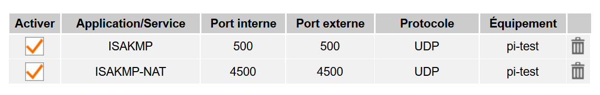
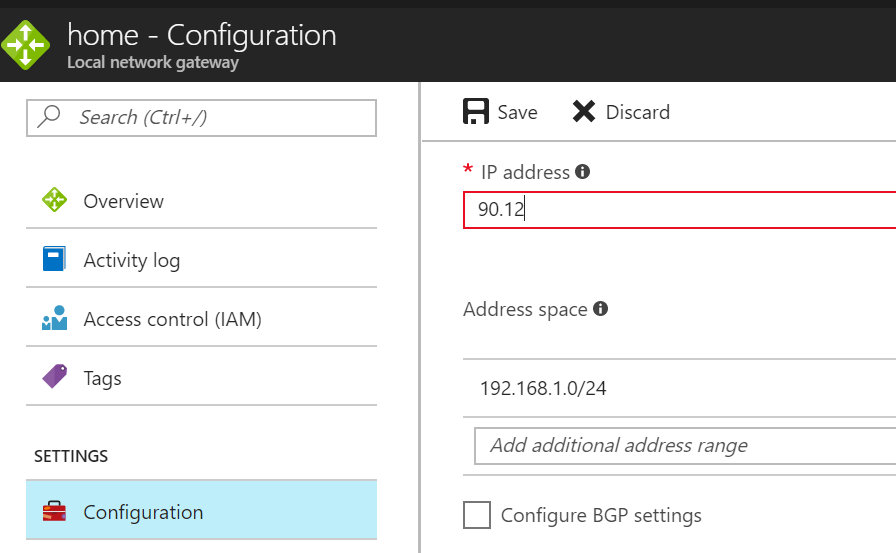

# Install a site to site VPN endpoint on a raspberry pi

The purpose of this script is to automatically configure a Raspeberry Pi as a local VPN endpoint. Do not expect a stellar performance of course (got 2MB/s througput), but for a home testing setup, it is sufficient.
>Althought it is an unsupported configuration, the script let you create the setup behind a Nat configuration. More on this below

The script will ask for:

* The Shared key to secure the VPN connection
* The admin password for the Azure linux A1 virtual machine created with the VPN

>Note: The script can take 30 minutes up to one hour to execute (typical duration of a an azure gateway creation)

## Prerequisites

A Paspberry Pi with Raspbian or Raspbian Lite (tested on a Raspberry Pi model 3 with Raspian Lite)

In order to execute the script, several packages need to be installed first:

* Azure CLI
* jq (in order to parse deployment results)
* StrongSwan (VPN package)

The [install.sh](https://raw.githubusercontent.com/Azure/azure-cli-samples/master/network/rasp-site2site-vpn/install.sh) script installs all the necessary packages on a vanilla machine. Just follow the instructions for installing azure cli (accept default values) and restart the shell and the end as instructed.

```bash
mkdir vpn
cd vpn
curl https://raw.githubusercontent.com/Azure/azure-cli-samples/master/network/rasp-site2site-vpn/install.sh -o install.sh
chmod u+x install.sh
./install.sh
```

## Building the Site to Site VPN

The create VPN script is structured in 3 main sections.

1. Retrieves network information on-premises (local network address public-facing network address, local subnet...)
1. Creates the Site2Site VPN by deploying the ARM template from GitHub
1. Creates the StrongSwan configuration info (ipsec.conf / ipsec.secrets) based on the installed gateway

```bash
curl https://raw.githubusercontent.com/Azure/azure-cli-samples/master/network/rasp-site2site-vpn/createVp,.sh -o createVpn.sh
chmod u+x createVpn.sh
./createVpn.sh
```

## Behind a NAT...

WARNING: This configuration is unsupported. However, it can work on non-production scenarios.

Establish the following static mapping in your ISP router/modem:

* UDP/500
* UDP/4500

Both ports should be mapped externally with the same numbers.



## When something goes wrong

### Check if the VPN is connected

```bash
$ sudo ipsec status

Routed Connections:
home-to-azure{1}:  ROUTED, TUNNEL
home-to-azure{1}:   192.168.1.0/24 === 10.3.0.0/16
Security Associations (1 up, 0 connecting):
home-to-azure[14822]: ESTABLISHED 90 seconds ago, 192.168.1.XX[192.168.1.XX]...52.XXX.XXX.XXX[52.XXX.XXX.XXX]
home-to-azure{1}:  INSTALLED, TUNNEL, ESP in UDP SPIs: cbd9bf18_i 5af5d926_o
home-to-azure{1}:   192.168.1.0/24 === 10.3.0.0/16
```

The Site2Site ARM template creates automatically an UBuntu virtual machine. This machine is ping-able

```bash
$ ping 10.3.0.4
PING 10.3.0.4 (10.3.0.4) 56(84) bytes of data.
64 bytes from 10.3.0.4: icmp_seq=1 ttl=63 time=113 ms
64 bytes from 10.3.0.4: icmp_seq=2 ttl=63 time=113 ms
64 bytes from 10.3.0.4: icmp_seq=3 ttl=63 time=113 ms
64 bytes from 10.3.0.4: icmp_seq=4 ttl=63 time=113 ms
```

### Diag StrongSwann

Check /var/log/syslog

### I do not have a permanent IP address

When the address changes, the ipsec status should show something like this:

```bash
$ sudo ipsec status
home-to-azure{1}:  ROUTED, TUNNEL
home-to-azure{1}:   192.168.1.0/24 === 10.3.0.0/16
Security Associations (1 up, 0 connecting):
home-to-azure[14811]: CONNECTING, 192.168.1.XX[%any]...52.XXX.XX.XXXX[%any]
```

In this case, retrieve the new external IP address :

```bash
curl ifconfig.me
```

Then go to the Azure portal, the resource group and change de local gateway network address with the new IP address.



There is no need to restart the vpn service. Connection will be done automatically

## References

[Azure Site to Site VPN ARM template](https://github.com/msleal/arm_templates/tree/master/azure-site2site-vpn)

[RFC 3947 - Negotiation of NAT-Traversal in the IKE](https://www.ietf.org/rfc/rfc3947.txt)
